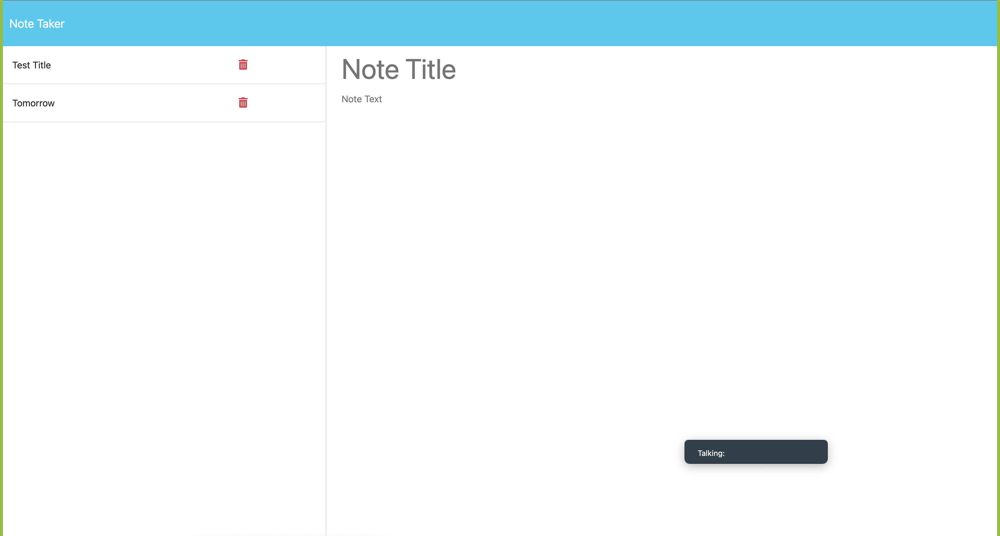

# Express.js Note Taker

This is a simple note-taking application built using Express.js. It allows users to create, view, and delete notes.

## Table of Contents

- [Installation](#installation)
- [Usage](#usage)
- [Features](#features)
- [Contributing](#contributing)
- [License](#license)

## Screenshots



## Installation

To install and run the application locally, follow these steps:

1. Clone this repository to your local machine.
   ```
   git clone https://github.com/MFKAMARA/note_taker
   ```

2. Navigate to the project directory.
   ```
   cd express-note-taker
   ```

3. Install the dependencies.
   ```
   npm install
   ```

4. Start the application.
   ```
   npm start
   ```

5. Open a web browser and go to `http://localhost:3001` to use the application.

## Usage

Once the application is running, you can do the following:

- Create a new note by clicking on the "+" button.
- View an existing note by clicking on it in the list.
- Delete a note by clicking on the trash can icon next to it.

## Features

- Create new notes
- View existing notes
- Delete notes

## Contributing

If you would like to contribute to this project, you can fork the repository, make your changes, and submit a pull request.

## License

This project is licensed under the MIT License - see the [LICENSE](LICENSE) file for details.


